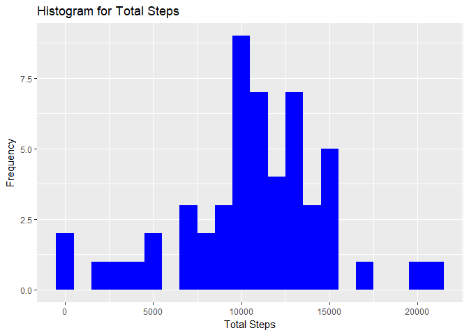
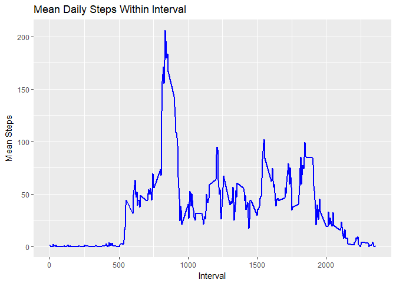
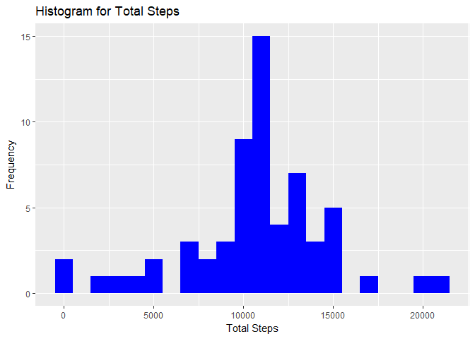
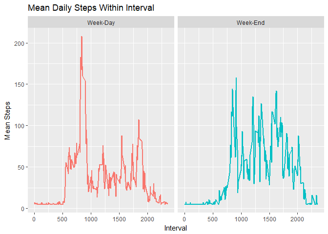

## Load in the data

```r
rm(list=ls())
setwd('C:/Users/domin/Desktop/CourseraProjects/Reproducible Research')
plist <- c('dplyr','ggplot2')
suppressWarnings(suppressMessages(suppressPackageStartupMessages(lapply(plist, require, character.only =T))))
unzip('repdata%2Fdata%2Factivity.zip')
ActivityDataR <- read.csv("activity.csv")
str(ActivityDataR)
```
## Initial Observations
1. The interval is a five minute time interval in military time, in the form hhmm up to 24 hours.
2. The date is a factor variable, so any analysis with this may have to be converted to a 'Date' datatype

## What is the mean total number of steps takens per day?
### 1. Calculate the Total Number of Steps Taken in a Day

```r
Total_Steps_Per_Day <- ActivityDataR %>% group_by(date) %>% summarize(total_steps = sum(steps))
head(Total_Steps_Per_Day)
```

```
## # A tibble: 6 x 2
##   date       total_steps
##   <fctr>           <int>
## 1 2012-10-01          NA
## 2 2012-10-02         126
## 3 2012-10-03       11352
## 4 2012-10-04       12116
## 5 2012-10-05       13294
## 6 2012-10-06       15420
```
### 2. Plot a histogram of Total Number of Steps Taken in a Day

```r
qplot(Total_Steps_Per_Day$total_steps, 
      geom = 'histogram', 
      binwidth = 1000,
      main = "Histogram for Total Steps", 
      xlab = "Total Steps",
      ylab = "Frequency",
      fill= I("blue"))
```

```
## Warning: Removed 8 rows containing non-finite values (stat_bin).
```

<!-- -->

### 3. Calculate the Mean and Median Total Number of Steps Taken in a Day

```r
meanMedian <-function(SpD){
    ABC <- list(
    (mean(SpD,na.rm = T)),
    (median(SpD,na.rm = T)))
    names(ABC) <- c('Mean','Median')
    print(ABC)
}
meanMedian(Total_Steps_Per_Day$total_steps)
```

```
## $Mean
## [1] 10766.19
## 
## $Median
## [1] 10765
```
Since we will have to calculate this again later, I created a quick function to facilitate the process

## What is the average daily activity pattern?
### 1. Make a time series plot of the 5-minute interval(X-axis) and the average number of steps taken, averaged across all days (y-axis)

```r
Interval_Averages <- ActivityDataR %>% group_by(interval) %>% summarize(mean_steps_per_interval = mean(steps, na.rm = T))
ggplot(Interval_Averages, aes(x = interval , y = mean_steps_per_interval)) + 
    geom_line(color="blue", size=1) + labs(title = "Mean Daily Steps Within Interval", x = "Interval", y = "Mean Steps")
```

<!-- -->

### 2. Which interval, on average across all days in the dataset, contains the max number of steps?

```r
Max_Interval <- Interval_Averages %>% slice(Max = which.max(mean_steps_per_interval))
head(Max_Interval)
```

```
## # A tibble: 1 x 2
##   interval mean_steps_per_interval
##      <int>                   <dbl>
## 1      835                     206
```

## Imputating the Missing Values
### 1. Calculate and report the total number of missing values in the dataset (i.e. the total number of rows with NA)

```r
Nas <- ActivityDataR[is.na(ActivityDataR$steps),]
head(Nas)
```

```
##   steps       date interval
## 1    NA 2012-10-01        0
## 2    NA 2012-10-01        5
## 3    NA 2012-10-01       10
## 4    NA 2012-10-01       15
## 5    NA 2012-10-01       20
## 6    NA 2012-10-01       25
```

### 2. Devise a strategy for filling in all of the missing values in the dataset.The strategy does not need to be sophisticated. For example, you could use the mean/median for that day, or the mean for that 5-minute interval.

```r
CountsbyData <- Nas %>% group_by(date) %>% summarize(Counts = n())
```

We see it is only over 8 days that there are missing values, this is approximately 7% of the dataset

```r
ActivityDataR$steps[is.na(ActivityDataR$steps)] <- round(mean(ActivityDataR$steps, na.rm = T),0)
```
Here we imputed the mean, since from the output earlier the data seems normal

### 3. Create a new dataset that is equal to the original dataset but with the missing data filled in.

```r
write.csv(ActivityDataR, "Complete_Cases_Activity_Data.csv")
```

### 4. Make a histogram of the total number of steps taken each day and calculate and report the mean and median total number of steps taken per day. Do these values differ from the estimates from the first part of the assignment? What is the impact of imputing missing data on the estimates of the total daily number of steps?

```r
Total_Steps_Per_Day1 <- ActivityDataR %>% group_by(date) %>% summarize(total_steps = sum(steps))
qplot(Total_Steps_Per_Day1$total_steps, 
      geom = 'histogram', 
      binwidth = 1000,
      main = "Histogram for Total Steps", 
      xlab = "Total Steps",
      ylab = "Frequency",
      fill= I("blue"))
```

<!-- -->

```r
meanMedian(Total_Steps_Per_Day1$total_steps)
```

```
## $Mean
## [1] 10751.74
## 
## $Median
## [1] 10656
```
The mean decreased slightly, since the mean for the dataset is being imputed, the median descreased as well.
The overall distribution became flatter at the tails, as data moved towards the center of mass.

## Are there differences in activity patterns between weekdays and weekends?
### 1. Create a new factor variable in the dataset with two levels – “weekday” and “weekend” indicating whether a given date is a weekday or weekend day

```r
ActivityDataR$date <- as.POSIXct(ActivityDataR$date, format = "%Y-%m-%d")
ActivityDataR <- ActivityDataR %>% mutate(Day_Type = weekdays(date))
ActivityDataR$DayClass <- as.factor(ifelse(ActivityDataR$Day_Type %in% c('Monday','Tuesday','Wednesday','Thursday','Friday'), 'Week-Day','Week-End'))
str(ActivityDataR)
```

```
## 'data.frame':	17568 obs. of  5 variables:
##  $ steps   : num  37 37 37 37 37 37 37 37 37 37 ...
##  $ date    : POSIXct, format: "2012-10-01" "2012-10-01" ...
##  $ interval: int  0 5 10 15 20 25 30 35 40 45 ...
##  $ Day_Type: chr  "Monday" "Monday" "Monday" "Monday" ...
##  $ DayClass: Factor w/ 2 levels "Week-Day","Week-End": 1 1 1 1 1 1 1 1 1 1 ...
```
### 2. Make a panel plot containing a time series plot, of the 5-minute interval (x-axis) and the average number of steps taken, averaged across all weekday days or weekend days (y-axis). See the README file in the GitHub repository to see an example of what this plot should look like using simulated data

```r
Interval_Averages1 <- ActivityDataR %>% group_by(interval,DayClass) %>% summarize(mean_steps_per_interval = mean(steps, na.rm = T))
ggplot(Interval_Averages1, aes(x = interval , y = mean_steps_per_interval, color = DayClass)) + 
    geom_line(size=1) + labs(title = "Mean Daily Steps Within Interval", x = "Interval", y = "Mean Steps") +
    facet_wrap(~DayClass) +
    theme(legend.position="none")
```

<!-- -->


